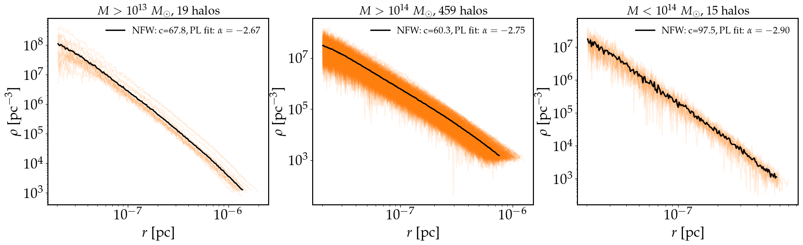

```python
In[1]: import h5py as h5
       import numpy as np
       import cmasher as cmr
       import matplotlib.pyplot as plt
       
       plt.rcParams['axes.linewidth'] = 1.5
       plt.rc('text', usetex=True)
       plt.rc('font',**{'family':'serif','serif':['Palatino']}, size=21)
```


```python
In[2]: catalogue = 'Full_Moore_iso_L3.hdf5' # Enter path to catalogue if necessary

       f = h5.File(catalogue, 'r')
       print("%d halos loaded"%len(list(f.keys())))
       print(list(f.keys())[:10]) # Ordered by first digit, not sequentially 
       print(list(f['Halo_0'].keys()))   
       print(np.array(f['Halo_0/r']).shape)
       print(np.array(f['Halo_0/rho']).shape)
       print(np.array(f['Halo_0/nfw_fit']))
       print(np.array(f['Halo_0/pl_fit']))
```

```markdown
Out[2]: 3246 halos loaded
        ['Halo_0', 'Halo_1', 'Halo_10', 'Halo_100', 'Halo_1000', 'Halo_1001', 'Halo_1002', 'Halo_1003', 'Halo_1004', 'Halo_1005']
        ['nfw_fit', 'pl_fit', 'r', 'rho']
        (199,)
        (199,)
        [3.15765399e+09 1.50206416e-08]
        [ 1.20746537e+03  2.20255982e-06 -2.80691176e+00]
```


## Density profiles plots

We can plot the profiles by minicluster mass, heaviest to lightest from left to right:

```python
In[3]: fig, ax = plt.subplots(1,3,figsize=(20,5))

       m1, m2, m3 = [], [], []
       a1, a2, a3 = [], [], []
       r1, r2, r3 = [], [], []
       
       for k in list(f.keys())[:-1]:
           mass   = f[k].attrs['Mass']
           radius = f[k].attrs['Radius']
           alpha  = f[k+'/pl_fit'][2] # PL fit rho~r^{alpha)
           rs     = f[k+'/nfw_fit'][1] # NFW scale radius
           filt   = np.array(np.where(np.array(f[k+'/rho'])==0)).size
           
           if filt > 0 or np.array(f[k+'/r'])[0]>5e-2: 
               continue
       
           x, y = np.array(f[k+'/r']), np.array(f[k+'/rho'])
           
           if mass > 1e-13:
               ax[0].loglog(x*radius,y, c='C1', alpha=0.1)
               m1.append([x*radius, y])
               a1.append(alpha)
               r1.append(radius/rs)
           elif mass > 1e-14:
               ax[1].loglog(x*radius,y, c='C1', alpha=0.1)
               m2.append([x*radius, y])
               a2.append(alpha)
               r2.append(radius/rs)
           else:
               ax[2].loglog(x*radius,y, c='C1', alpha=0.1)
               m3.append([x*radius, y])
               a3.append(alpha)
               r3.append(radius/rs)
                   
       
       av_r_1   = np.mean(np.array(m1), axis=0)[0]
       av_rho_1 = np.mean(np.array(m1), axis=0)[1]
       av_r_2   = np.mean(np.array(m2), axis=0)[0]
       av_rho_2 = np.mean(np.array(m2), axis=0)[1]
       av_r_3   = np.mean(np.array(m3), axis=0)[0]
       av_rho_3 = np.mean(np.array(m3), axis=0)[1]
       
       
       ax[0].loglog(av_r_1, av_rho_1, c='k', lw=2, label=r'NFW: c=%.1f,   PL fit: $\alpha=-%.2f$'%(np.mean(r1),np.abs(np.mean(a1))))
       ax[1].loglog(av_r_2, av_rho_2, c='k', lw=2, label=r'NFW: c=%.1f,   PL fit: $\alpha=-%.2f$'%(np.mean(r2),np.abs(np.mean(a2))))
       ax[2].loglog(av_r_3, av_rho_3, c='k', lw=2, label=r'NFW: c=%.1f,   PL fit: $\alpha=-%.2f$'%(np.mean(r3),np.abs(np.mean(a3))))
       ax[0].set_title(r'$M>10^{13}~M_{\odot}$, %d halos'%(len(m1)), fontsize=18)
       ax[1].set_title(r'$M>10^{14}~M_{\odot}$, %d halos'%(len(m2)), fontsize=18)
       ax[2].set_title(r'$M<10^{14}~M_{\odot}$, %d halos'%(len(m3)), fontsize=18)
       
       for i in range(len(ax)):
           ax[i].set_xlabel(r'$r$ [pc]')
           ax[i].set_ylabel(r'$\rho $ [pc$^{-3}$]')
           ax[i].legend(frameon=False, fontsize=14)
       plt.show()
```


    
```markdown
Out[3]: 
```

 


