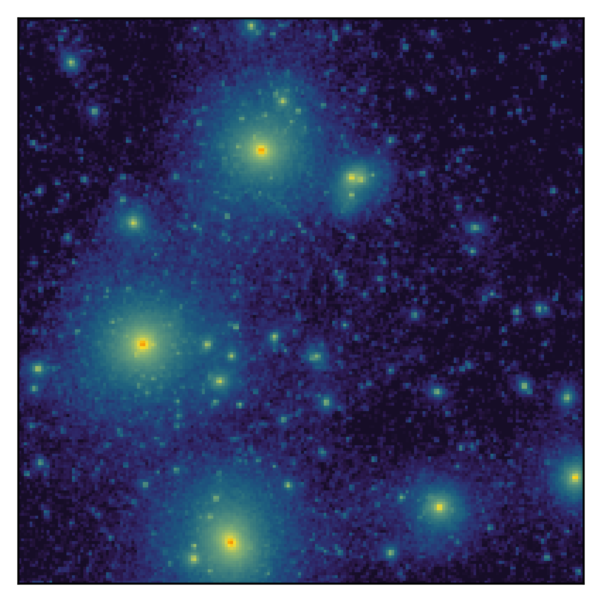
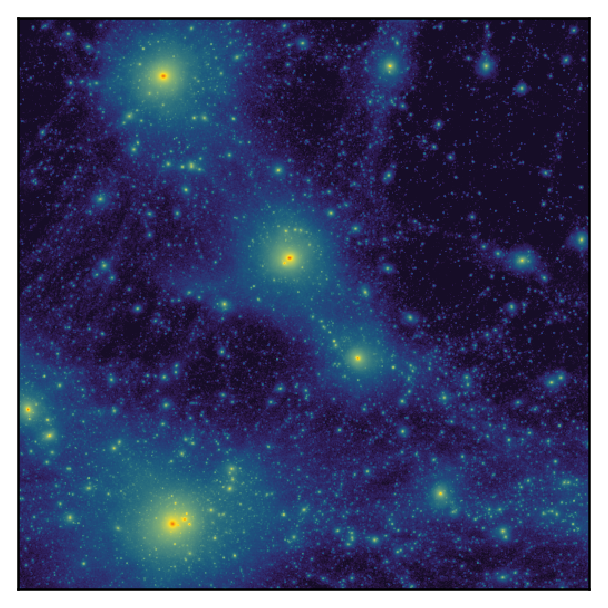
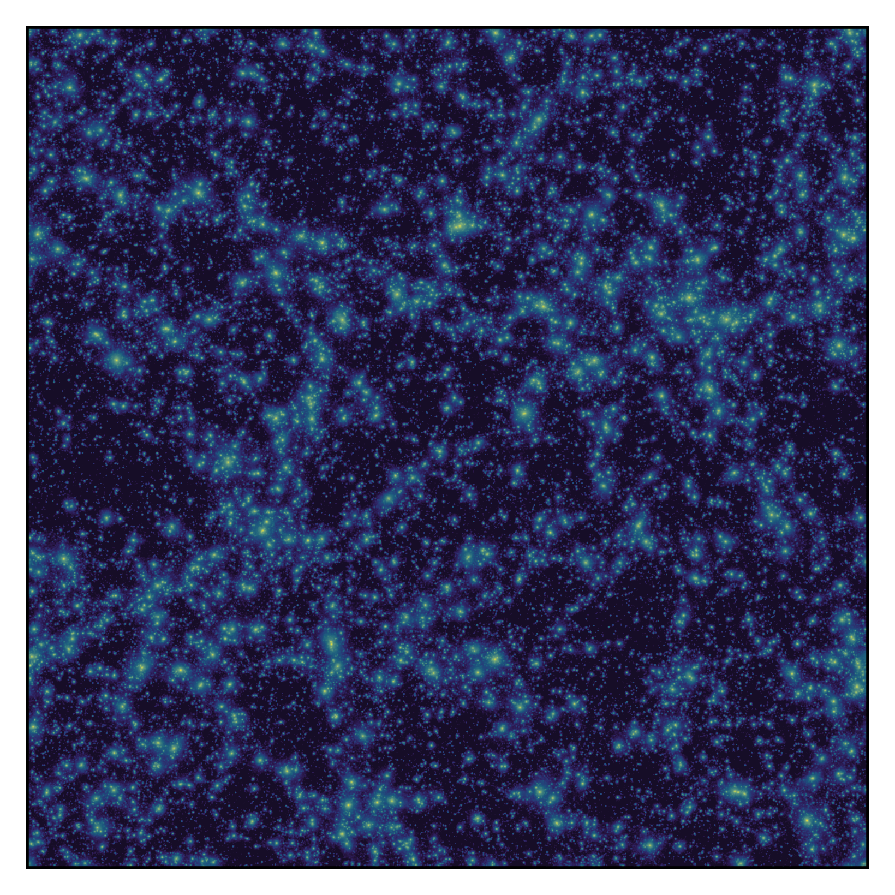

Welcome to the **AMC catalogue**. 

***In progress ...***

## The simulations

Using [jaxions][Jaxions repo] for the lattice part and [gadget4][gadget4 repo] 
for the N-body part, which generates the catalogue using Friends-of-Friends and 
Subfind.

  <figure style="flex: 1; margin: 0px; text-align: center;">
    
    <figcaption>Direct (jaxions)</figcaption>
  </figure>
  <figure style="flex: 1; margin: 0px; text-align: center;">
    
    <figcaption>Direct (Moore)</figcaption>
  </figure>
  <figure style="flex: 1; margin: 0px; text-align: center;">
    
    <figcaption>Indirect, q=2</figcaption>
  </figure>

### Scientific papers

- *G.Pierobon, J. Redondo, K. Saikawa, A. Vaquero, G. Moore*, Miniclusters from axion string simulations, [2307.09941 ](https://arxiv.org/abs/2307.09941)

 
 

---
#### **Lite catalogues from Subfind**
[Download .zip](assets/files/Lite.zip){: .btn}

The lite version of the catalogues only contain masses and radii of all miniclusters, including the subhalos inside the merged halos. Data is ordered by halo mass. Radii are defined such that they contain 90% of the halo mass.

| Description                   | \\(N_p\\) | # Halos  | Download                                      |
|-----------------|---------------------------|----------------------------------------------------|
| Direct   (jaxions)    \\(~ ~ z=269,~\\)  \\(L=0.286\\) pc\\(/h\\) |\\(512^3\\) |  | Lite_jaxions_L8.txt             |
| Direct   (jaxions)    \\(~ ~ z=499,~\\)  \\(L=0.571\\) pc\\(/h\\) |\\(512^3\\) |  | Lite_jaxions_L16.txt             |
| Direct   (Moore)    \\(~ ~ z=499,~\\)  \\(L=0.103\\) pc\\(/h\\)  | \\(512^3\\) | 39594 | [Lite_Moore_L2.txt](assets/files/Lite_catalogues/Lite_Moore_L2.txt) (1.9 MB)            |
| Direct   (Moore)    \\(~ ~ z=499,~\\)  \\(L=0.182\\) pc\\(/h\\)  | \\(512^3\\) | 26787 | [Lite_Moore_L3.txt](assets/files/Lite_catalogues/Lite_Moore_L3.txt)  (1.3 MB)           |
| Indirect   (Moore)  \\(~ ~ z=99,~\\)   \\(L=0.051\\) pc\\(/h\\)  | \\(512^3\\) |  | Lite_q2_L1.txt              |

---

#### **Full catalogues from Subfind**

The full version of the catalogues only contain masses and radii of all miniclusters, including the subhalos inside the merged halos. Data is ordered by halo mass. Radii are defined such that they contain 90% of the halo mass.

| Description                   | \\(N_p\\) | # Halos  | Download                                      |
|-----------------|---------------------------|----------------------------------------------------|
| Direct   (jaxions)    \\(~ ~ z=269,~\\)  \\(L=0.286\\) pc\\(/h\\) |\\(512^3\\) |  | Full_jaxions_L8.hdf5             |
| Direct   (jaxions)    \\(~ ~ z=499,~\\)  \\(L=0.571\\) pc\\(/h\\) |\\(512^3\\) |  | Full_jaxions_L16.hdf5             |
| Direct   (Moore)    \\(~ ~ z=499,~\\)  \\(L=0.103\\) pc\\(/h\\)  | \\(512^3\\) |  | [Full_Moore_L2.hdf5](assets/files/Full_Moore_L2.hdf5)        |
| Direct   (Moore)    \\(~ ~ z=499,~\\)  \\(L=0.182\\) pc\\(/h\\)  | \\(512^3\\) |  | [Full_Moore_L3.hdf5](assets/files/Full_Moore_L3.hdf5)  |
| Indirect   (Moore)  \\(~ ~ z=99,~\\)   \\(L=0.051\\) pc\\(/h\\)  | \\(512^3\\) |  | Full_q2_L1.hdf5              |

---

<!---

---
##### [**Raw Subfind data**]()

Blah blah 
How to analyse [here]()

---

---
##### [**Snapshots**]()
---

-->

[Jaxions repo]: https://github.com/veintemillas/jaxions/
[gadget4 repo]: https://wwwmpa.mpa-garching.mpg.de/gadget4/
